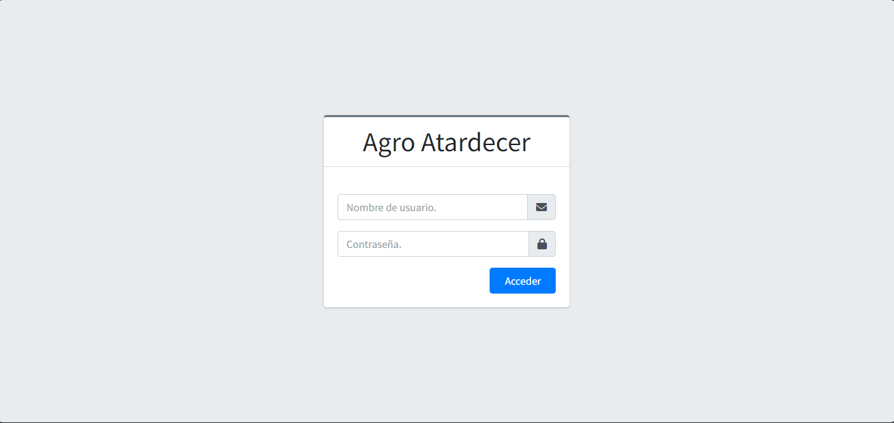
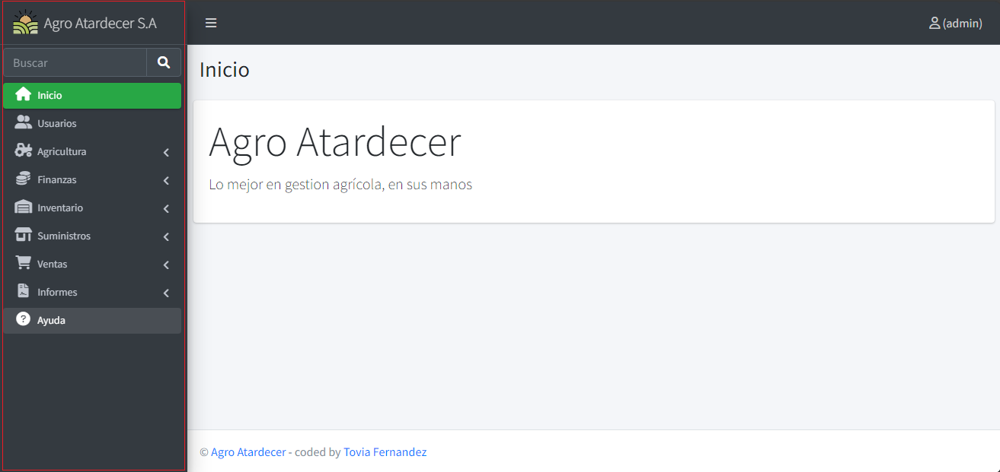

# Acceso

## Logueo

El usuario accede a la pantalla de Acceso del Usuario, procede a insertar su “Usuario” y la “Contraseña” para poder acceder al sistema. 

## Menu Principal

Si toda la información fue correctamente insertada, se procede a acceder al menú principal o página principal del sistema.

