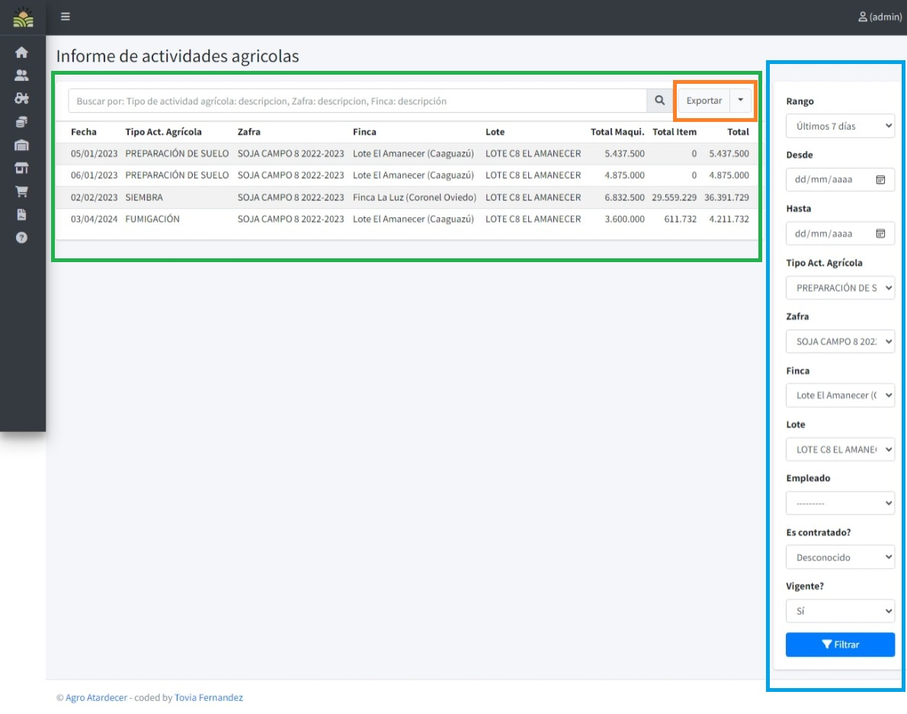

# Funciones de Informes

## Vista Principal y Filtros 

!!! info 
    - Sección resaltada en azul (Filtros que afectarán a los detalles cargados)
    - Sección resaltada en verde (Detalles del Informe)
    - Botón "Filtrar": Genera los detalles a partir de los filtros cargados.
    - Botón "Limpiar": Elimina los filtros y carga la información si no hay filtros añadidos.
    - Botón "Exportar": Permite exportar los detalles del informe en varios formatos.

En la vista principal de la sección de informes, se destacan dos áreas clave: los filtros que permiten personalizar los detalles del informe (en azul) y los propios detalles del informe (en verde).

Al utilizar el botón "Filtrar", se generan los detalles del informe según los filtros seleccionados. Para limpiar los filtros y cargar la información sin filtros adicionales, puedes utilizar el botón "Limpiar". Además, si deseas exportar los detalles del informe, puedes hacer clic en el botón "Exportar".

El botón "Exportar" ofrece las siguientes opciones:
- **PDF**: Exporta los detalles del informe en formato PDF.
- **XLSX**: Exporta los detalles del informe en formato Microsoft Excel (XLSX).
- **ODS**: Exporta los detalles del informe en formato OpenDocument Spreadsheet (ODS).
- **CSV**: Exporta los detalles del informe en formato CSV.

Esta interfaz intuitiva proporciona a los usuarios un control eficiente sobre la generación y visualización de informes, permitiéndoles personalizar la información según sus necesidades específicas y exportarla en diferentes formatos según sus preferencias.
