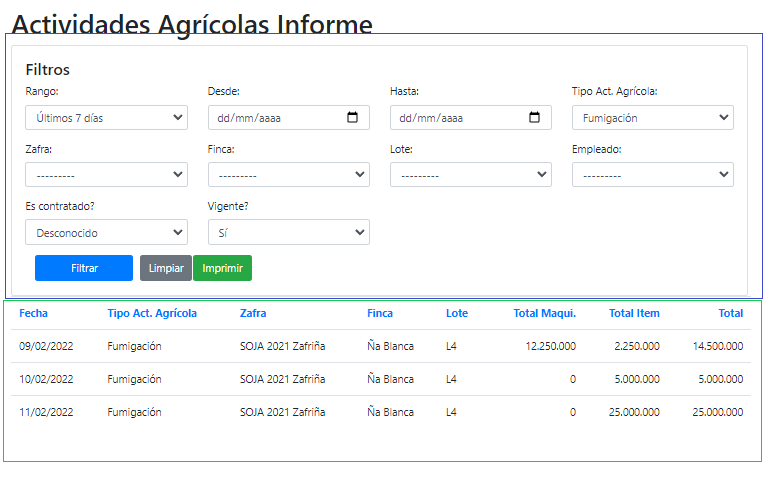

# Funciones Informes

## Vista Principal y Filtros 

!!! info 
    * Apartado enmarcado en azul (Filtros que afectara a los detalles cargados)
    * Apartado enmarcado en verde (Detalles del Informe)
    * Botón Filtrar: Genera los detalles a partir de los filtros cargados.
    * Botón Limpiar: Limpia los filtros y carga la informaciones si filtros añadidos.
    * Botón Imprimir: Genera una impresión del informe.

