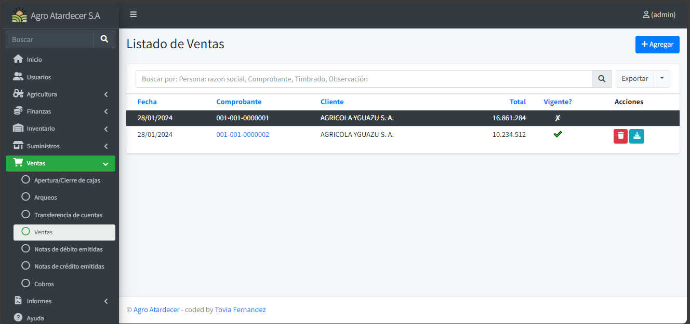
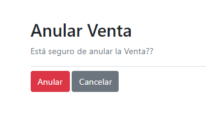
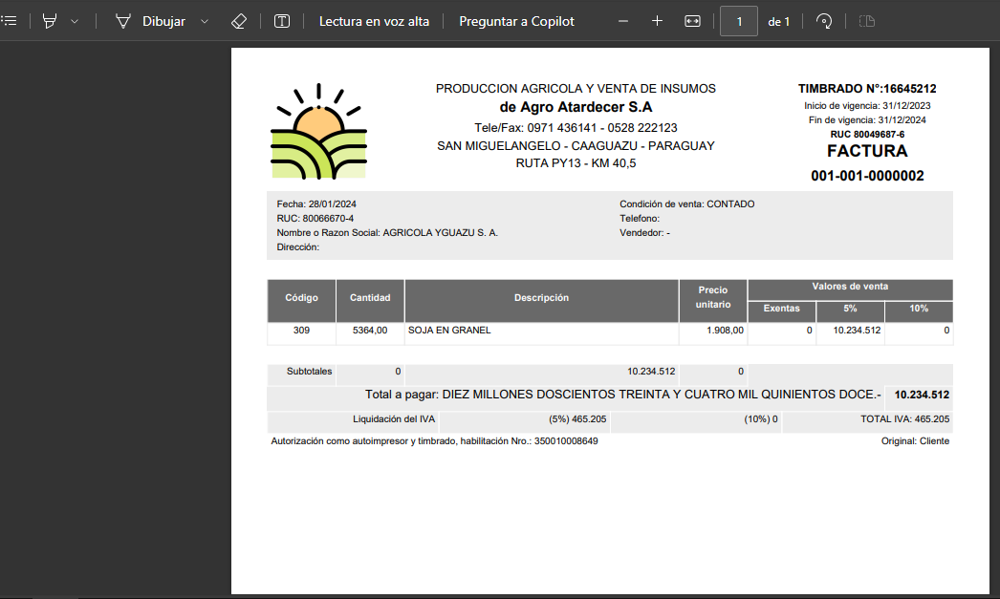
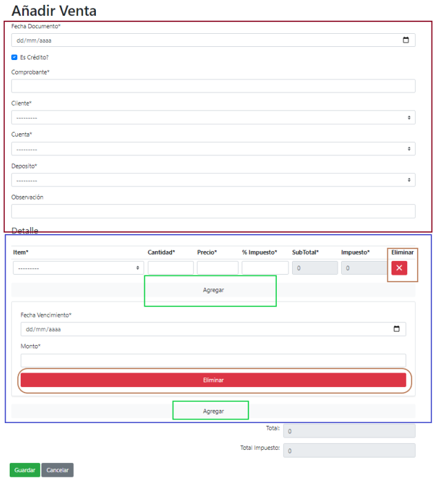
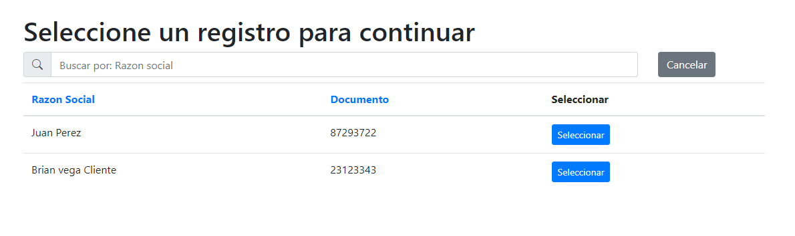
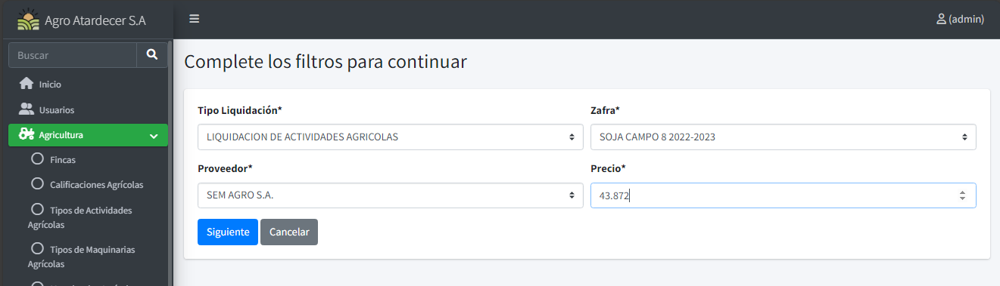

# Funciones Movimientos

A demás de lo aprendido para los formularios de movimientos, para esta opción la pantalla de listado sería muy parecido, a excepción de nuevas funciones y opciones.

!!! info
    En este caso, tomaremos el formulario de Venta como ejemplo

## Listado Base 

Como podemos ver en la imagen se añaden nuevas funcionalidades nuevas propias del formulario.

!!! info
    Los registro tachados y pintados en color gris, significan que están Anulados. 

 

## Anular Movimientos

Oprimimos el botón de anular, y nos arrojara a una ventana parecida a la de eliminación

 

 Procedemos a oprimir en el botón rojo para anular la venta en este caso.

 

## Descarga de Comprobante

 En algunos movimientos, el sistema tiene la opción para descargar un comprobante, procedemos a oprimir el botón de ´Descargar Factura´

  

 Al oprimir dicho botón, se descargará un archivo en su directorio local.

  

## Registrar Movimiento

!!! info 

    * Apartado enmarcado en rojo (Información de cabecera del movimiento)

    * Apartado enmarcado en azul (detalles del movimiento)

    * Apartado enmarcado en naranja (opción de eliminado de detalle)

    * Apartado enmarcado en verde (opción de añadir nuevo detalle)

  

Una vez cargado toda la información necesaria y haber pasado las diferentes validaciones del sistema, se procede a guardar la información cargada.

## Pre Selección de Carga

Algunos formularios de Movimientos: Cobro, Cierre de Zafra y Liquidaciones Agrícolas; poseen una pequeña ventana de selección antes de registra el movimiento.

!!! info 

    * Para este caso utilizaremos el formulario de Cobro.

    * Una vez oprimido el botón de añadir visualizaremos una ventana de selección.

 Procedemos a seleccionar el deseado y ya estaremos registrando el movimiento

   

Una vez seleccionado, se precargará las informaciones correspondientes a la selección prueba que realizó el usuario.

Otro tipo es el del formulario de Liquidación Agrícola.

Se procede a completar y ya visualizaremos el formulario de movimiento.

 