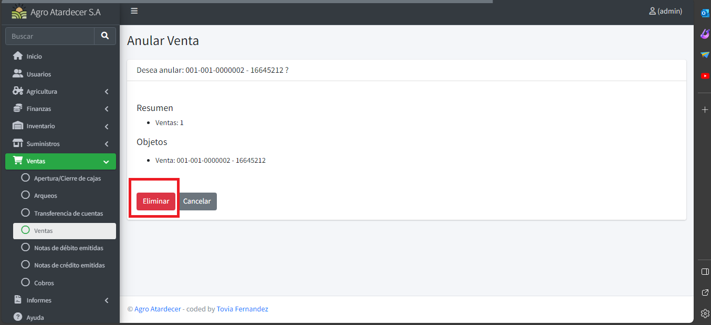
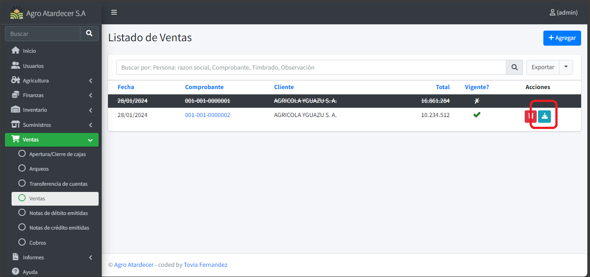

# Funciones de Movimientos

Además de lo aprendido en los formularios de movimientos, en esta sección se presentan nuevas funciones y opciones. Tomaremos como ejemplo el formulario de Venta para ilustrar estas características adicionales.

!!! info
    En este caso, nos centraremos en el formulario de Venta como ejemplo.

## Listado Base 

La pantalla de listado incorpora nuevas funcionalidades específicas de este formulario. Los registros tachados y pintados en gris indican que están anulados.

 !!! info
    Los registros tachados y pintados en color gris, significan que están Anulados. 

 

## Anular Movimientos

Al oprimir el botón de "Anular", nos dirigirá a una ventana similar a la de eliminación.

 

Procedemos a oprimir en el botón rojo para anular la venta en este caso.

 

## Descarga de Comprobante

En algunos movimientos, el sistema ofrece la opción de descargar un comprobante. Procedemos a oprimir el botón 'Descargar Factura'.

 

Al oprimir dicho botón, se descargará un archivo en su directorio local.

 

## Registrar Movimiento

!!! info 
    - Apartado enmarcado en rojo (Información de cabecera del movimiento)
    - Apartado enmarcado en azul (detalles del movimiento)
    - Apartado enmarcado en naranja (opción de eliminado de detalle)
    - Apartado enmarcado en verde (opción de añadir nuevo detalle)

 

Una vez cargada toda la información necesaria y haber pasado las diferentes validaciones del sistema, se procede a guardar la información cargada.

## Pre Selección de Carga

Algunos formularios de Movimientos, como Cobro, Cierre de Zafra y Liquidaciones Agrícolas, poseen una pequeña ventana de selección antes de registrar el movimiento.

 !!! info 
    - Para este caso utilizaremos el formulario de Cobro.
    - Una vez oprimido el botón de añadir visualizaremos una ventana de selección.

Procedemos a seleccionar el deseado y ya estaremos registrando el movimiento.

   

Una vez seleccionado, se precargará la información correspondiente a la selección que realizó el usuario.

Otro tipo es el del formulario de Liquidación Agrícola.

Se procede a completar y ya visualizaremos el formulario de movimiento.

 
