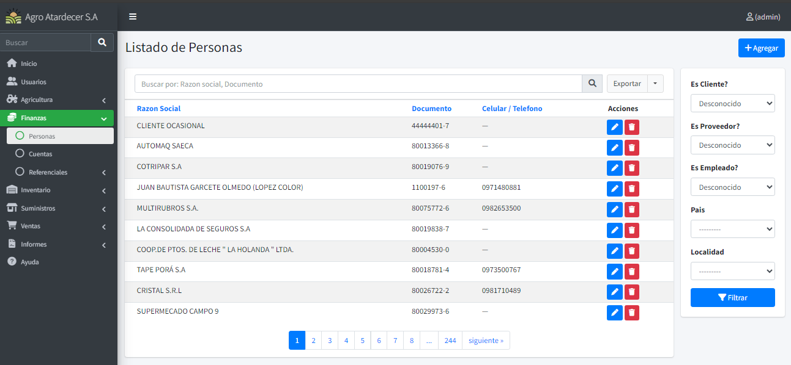
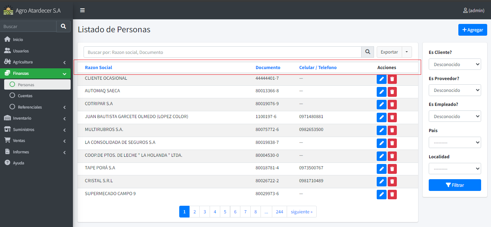
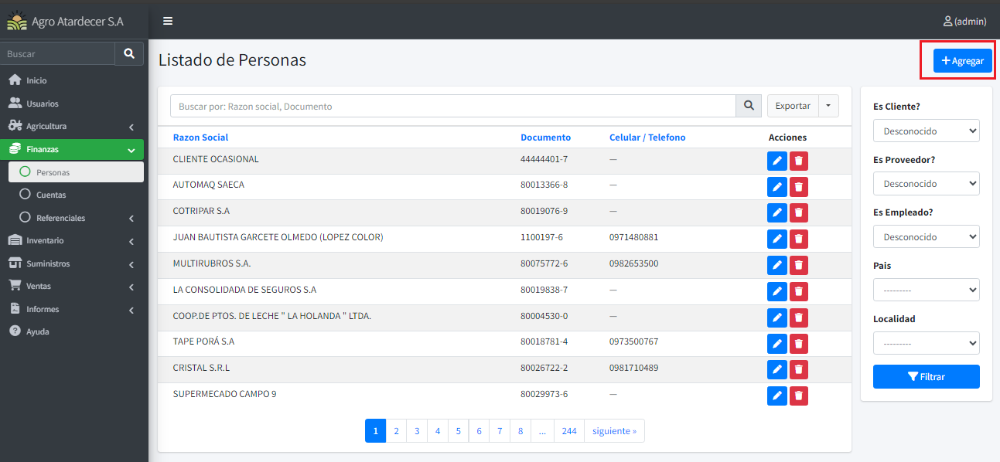
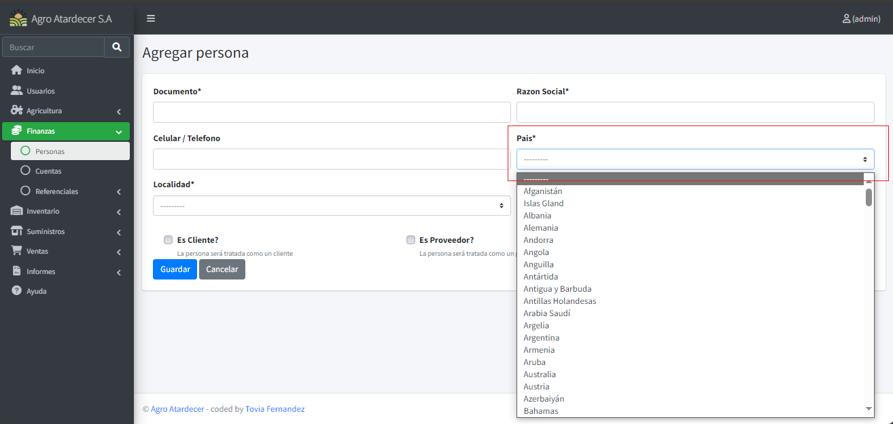
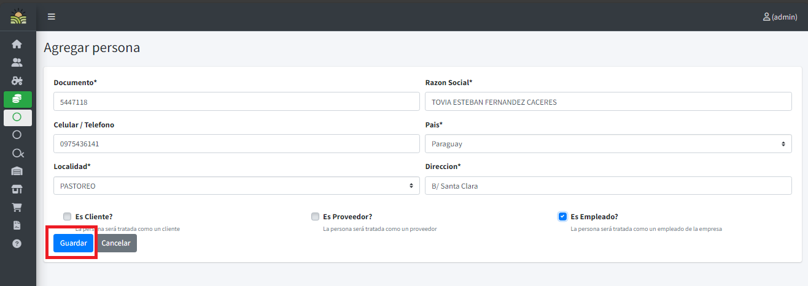
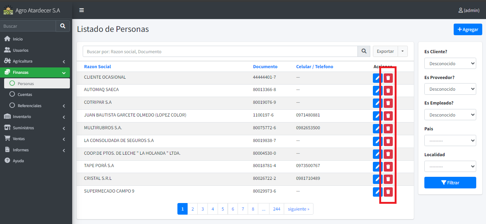
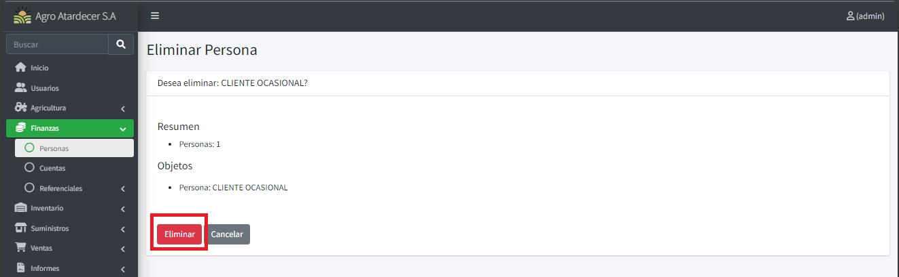
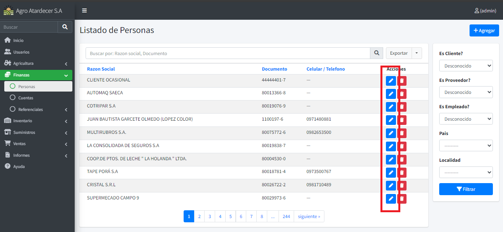
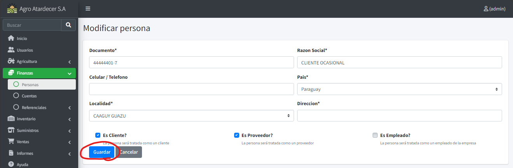

# Funciones Registros

## Listado Base

Al acceder a alguna pantalla de registro básico, el sistema cuenta con una vista de listado de los registros ya cargados.
En este caso tomaremos como ejemplo el formulario de `Personas`.

 

 Si desea ordenar alguna información, solo oprima en las cabeceras para realizar una ordenación por dicha columna seleccionada

  

## Creando Registro.

Siguiendo con el ejemplo de personas, para crear un nuevo registro, se procede a oprimir el siguiente botón.

  

 Una vez oprimido, nos aparecerá la ventana de registro.
!!! info 
    El símbolo `*` ej.: `Razón Social *` significa que el campo es requerido.

Los campos del tipo combo `(---------- <)` significan información relacionada (Información de tipo referencial):

 

 Una vez cargado toda la información en los campos en pantalla se procede a oprimir el botón “Guardar”

  

## Eliminando un registro.

Oprimir el botón de” Eliminar” que corresponde al detalle que queremos eliminar.

Esto nos llevara a una ventana de confirmación de eliminación, procedemos a aceptar presionar “Eliminar” para confirmar la eliminación, o cancelar para dejar sin efecto.

## Actualizando un registro.

Oprimimos el botón de “Editar” al detalle que queramos actualizar alguna información.

Una vez oprimido, el sistema nos arrojará una ventana con la información pre cargada. Modifique lo que desee y proceda a oprimir “Guardar” para salvar los cambios realizados

