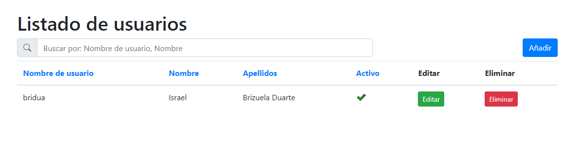
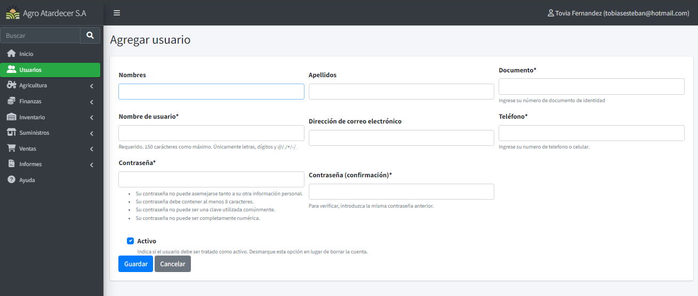
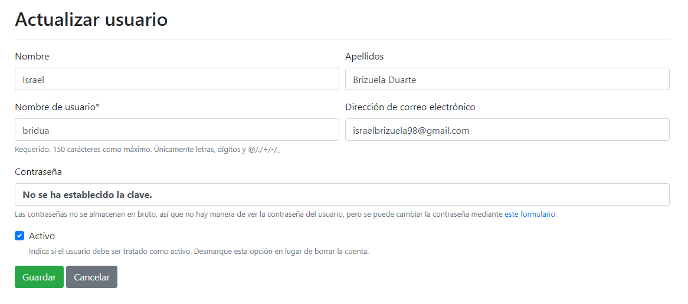
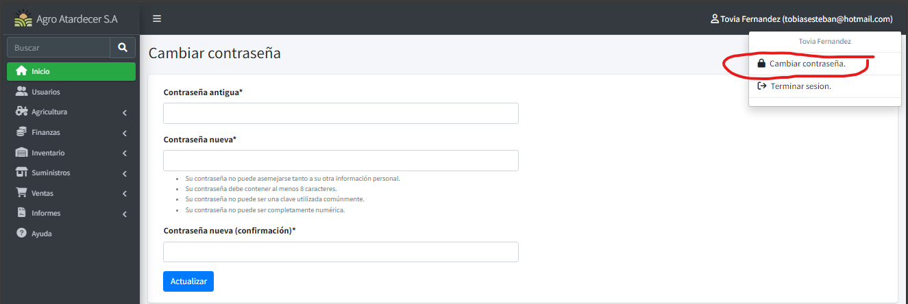
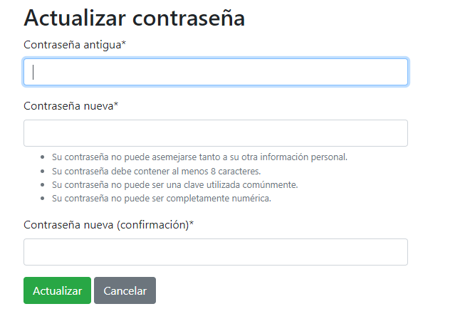

# Mantenimiento Usuarios

## Listado Base.

Si el usuario posee los permisos de acceso, puede crear nuevos usuarios, accediendo a la opción de “Usuarios” que está ubicado en la barra del menú principal.

Una vez accedido visualizará esta pantalla 

!!! Info
    Funciona de la misma manera que los puntos vistos anteriormente

## Registrando Usuario.

Oprima Añadir y visualizará esta pantalla, cargue todas las informaciones y guarde el registro, con esto tendrá un nuevo usuario dentro del sistema.

## Actualizando Usuario.

Al acceder al modo Actualización (oprimiendo el botón editar), podrá modificar varias informaciones; excepto la de contraseña.

## Resetear Contraseña 

Acceda a la opción de que está ubicada en el menú con el nombre del usuario actual y oprima la opción de “Cambiar contraseña”

Una vez dentro, se le pedirá que cargue la contraseña antigua y la nueva para poder confirmar el cambio.

